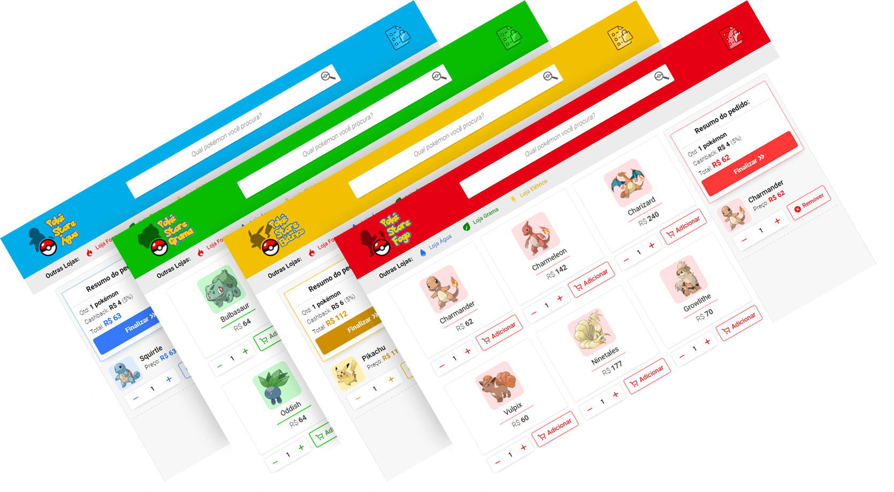
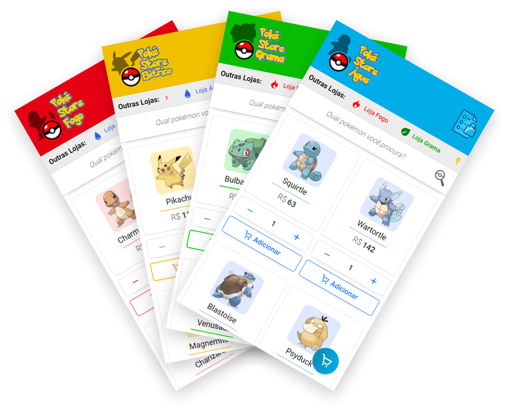

<h2 align="center">
    
</h2>

# Poké Store

👉 **Veja o App em funcionamento**: https://pokestore-blond.vercel.app/

---

A **Poké Store** é um web app que simula uma **loja online** de Pokémons. São **4 lojas** ao todo, em que você pode comprar pokémons de diferentes estilos.

O app permite que você **filtre pokémons**, veja sua **lista de compras** e **salve os dados localmente**.

A Poké Store foi feita com **ReactJS**, utilizando **JavaScript com Typescript**, e o acesso aos dados dos pokémons é feito pela API **[PokéAPI](https://pokeapi.co)**.

---

## 💻 Desktop

<h5 align="center">
  
</h5>

## 📱 Mobile

<h5 align="center">
  
</h5>

---

## 💾 Instalação

Você precisará ter o **Yarn** instalado no seu computador. Após instalá-lo:
1. Clone o Repositório.
2. Vá até o diretório do Repositório e rode ``yarn`` para instalar as dependências.
3. Rode ``yarn start`` para iniciar o ReactJS.

---

## 🚀 Tecnologias Utilizadas

- ReactJS.
- JavaScript/TypeScript.
- Sass.
- Axios.
- StyledComponents.
