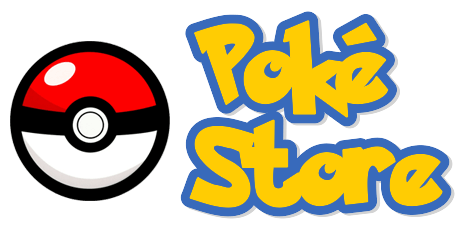

<h2>
    
</h2>

# Poké Store

**Veja o App em funcionamento**: https://pokestore-blond.vercel.app/

---

A **Poké Store** é um web app para o desafio da B2W. São **4 lojas** em que você pode comprar pokémon de diferentes estilos. O web app permite que você filtre pokémons, veja sua lista de compras e salve os dados localmente.
A Poké Store foi feito com **ReactJS**, utilizando **JavaScript com Typescript**, e o acesso aos dados dos Pokémon é feito pela REST API **<a href="https://pokeapi.co"">PokéAPI</a>**.

---

## Vídeo

<h5 align="center">
  <video width='90%' controls="true" title="#video" allowfullscreen="true" poster=".github/poster_image.png">
    <source src=".github/video.mp4" type="video/mp4">
  </video>
</h5>

## Desktop

<h5 align="center">
  
</h5>

<h5 align="center">
  
</h1>

<h5 align="center">
  
</h1>

<h5 align="center">
  
</h1>

## Mobile

<h5 align="center">
  
</h5>

---

## Instalação

Você precisará ter o **Yarn** instalado no seu computador. Após instalar:
1. Clone o Repositório.
2. Vá até o diretório do Repositório e rode ``yarn``.
3. Rode ``yarn start`` para iniciar o ReactJS.

---

## Tecnologias Utilizadas

- ReactJS.
- JavaScript/TypeScript.
- Axios.
- StyledComponents.

